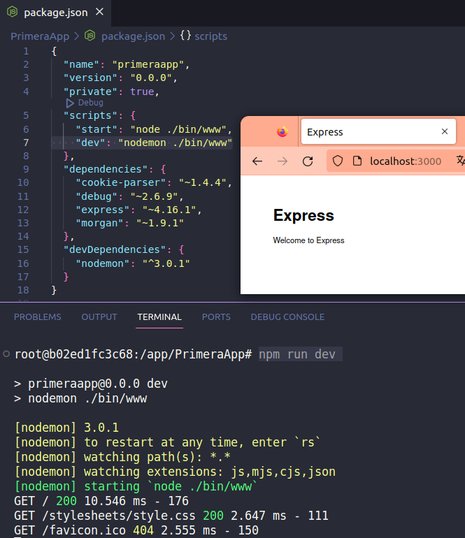
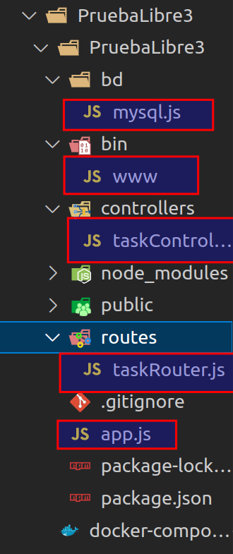

express --no-view --git PrimeraApp

npm install --save-dev nodemon



```bash
{
  "name": "coches",
  "version": "0.0.0",
  "private": true,
  "scripts": {
    "dev": "nodemon ./bin/www"
  },
  "dependencies": {
    "cookie-parser": "~1.4.4",
    "cors": "^2.8.5",
    "debug": "~2.6.9",
    "express": "^4.18.2",
    "morgan": "~1.9.1",
    "mysql": "^2.18.1"
  },
  "devDependencies": {
    "nodemon": "^3.0.1"
  }
}
```



# mysql.js

const mysql = require('mysql');  
const conector = mysql.createConnection({  
host: 'mysql',  
user: 'root',  
password: 'password123',  
database:'pruebalibre3'  
});  
module.exports=conector;

# www

const app = require('../app');  
const http = require('http');

const server = http.createServer(app);  
server.listen(3000);

console.log("Servidor web http://localhost:3000");

&nbsp;

# app

&nbsp;  
const express = require('express');  
const app = express();

const logger = require('morgan');  
const instanciaRouter = require('./routes/taskRouter');

app.use(logger('dev'));  
app.use(express.json());  
app.use(instanciaRouter);

module.exports = app;

&nbsp;

# taskcontroller

const conector = require('../bd/mysql');  
const instanciaControlador = {};

instanciaControlador.getAllTasks = (req, res) => {  
const tabla = req.params.tabla;  
const sql = `SELECT * FROM ${tabla}`;

conector.query(sql, (error, resultado) => {  
if (error)  
throw error;

```
if (resultado.length > 0) {
    res.setHeader("Content-Type", "application/json");
    res.send(JSON.stringify({ respuesta: resultado }));
} else {
    res.status(404);
    res.setHeader("Content-Type", "application/json");
    res.send(JSON.stringify({ respuesta: "Posición no encontrada" }));
}
```

});

}  
module.exports=instanciaControlador;

&nbsp;

# taskroutes

const {Router} = require('express');  
const instanciaRouter = Router();

const instanciaControlador = require('../controllers/taskControllers');

instanciaRouter.get('/:tabla', instanciaControlador.getAllTasks);

// instanciaRouter.get('/tareas/:id', instanciaControlador.getTasks);  
// instanciaRouter.post('/tareas', instanciaControlador.createTasks);  
// instanciaRouter.put('/tareas/:id', instanciaControlador.updateTasks);  
// instanciaRouter.delete('/tareas/:id', instanciaControlador.deleteTasks);

module.exports = instanciaRouter;

&nbsp;

# docker-compose.yml

version: '2'  
services:  
node:  
tty: true  
image: docker.io/bitnami/node:20  
ports:  
\- 3000:3000  
volumes:  
\- .:/app  
mysql:  
image: mysql:8  
command: --default-authentication-plugin=mysql\_native\_password  
ports:  
\- 3306:3306  
environment:  
\- MYSQL\_ROOT\_PASSWORD=password123  
\- MYSQL\_DATABASE=todos  
volumes:  
\- mysql\_data:/var/lib/mysql  
phpmyadmin:  
image: phpmyadmin/phpmyadmin  
ports:  
\- 8081:80  
environment:  
\- PMA\_HOST=mysql  
links:  
\- mysql:mysql  
volumes:  
mysql\_data: